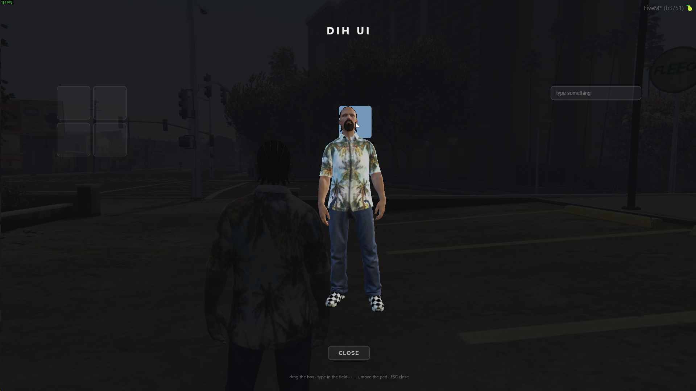

# fivem-ped-over-nui-example



an example of how to put a ped in front of your nui with all the NUI interactivity still working.

## Try it

```
cd web
npm install
npm run build
```

then `ensure fivem-ped-over-nui-example` and type `/pedui` in game.

drag the box between slots, type in the field, arrow keys move the ped, ESC closes.

## The ui

react + vite + typescript, lives in `web/`. for hot reload while u work on it, swap the two `ui_page` lines in `fxmanifest.lua` so it points at the dev server, then:

```
cd web
npm run dev
```

edit anything in `web/src` and it reloads in game while u play. when u are done, run `npm run build` and swap the `ui_page` lines back.

## put it in your own resource

1. copy `dui2d.lua` (load it before your client script) and `web/src/dui.ts`
2. call `setupMirror()` before react renders
3. `Dui2D.Show()` when your menu opens, `Dui2D.Hide()` when it closes
4. in the page, use `DUI.call('name', data)` instead of fetch for your nui callbacks
5. anything u load from lua, send it with `DUI.pushState('key', value)` and read it with `DUI.onState('key', setState)`

thats it, the rest of your ui is normal react (if you use react).

## Notice

**your page runs twice.** one copy is invisible and handles clicks, the other is the one u actually see. thats how the ped gets in between. so:

- use `addEventListener` for anything that has to show up on screen, not react props like `onMouseDown`. `onClick` is fine
- dont trust `Math.random()` or timers to look the same in both copies
- its two browsers, so its heavy. use it for stuff where you need a ped, not for your whole ui (like inventories, etc)

**the ped only fits in 3 spots** (left, middle, right), theres no native to place it freely.

## License

MIT, do whatever u want with it, its an example.